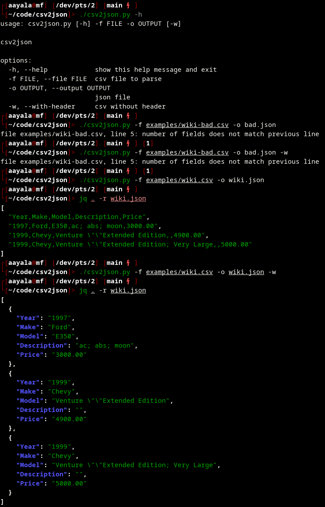

# csv2json

Examples csv files come from:
  - https://catalog.data.gov/dataset/electric-vehicle-population-data
  - https://wsform.com/knowledgebase/sample-csv-files
  - https://en.wikipedia.org/wiki/Comma-separated_values

Notes: 
  - commas inside quotes are replaced with semicolons

Issues:
  - need to write unittest
